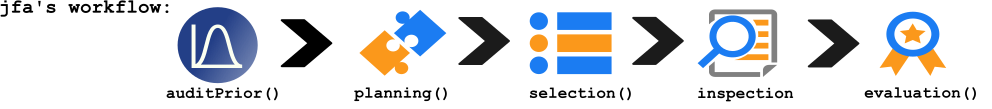
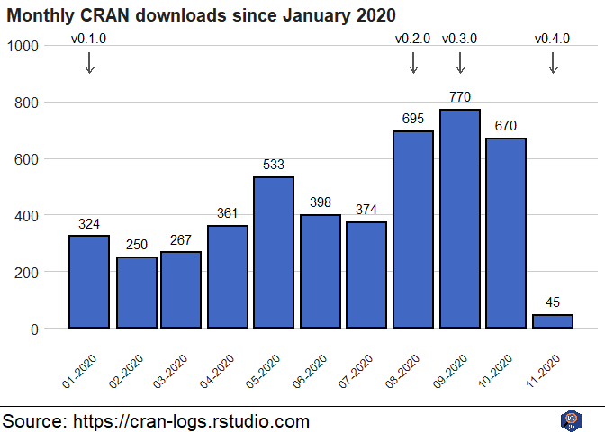

<!-- badges: start -->

 <!-- badges: end -->

# jfa: Bayesian and Classical Audit Sampling

`jfa` is a multi-functional R package for statistical audit sampling.
The package provides the user with four generic functions for planning,
performing, and evaluating an audit sample and its results.
Specifically, it contains functions for calculating sample sizes,
selecting the transactions according to standard auditing techniques,
and calculating various upper limits for the misstatement from the
sample or from summary statistics. The package also allows the user to
create a Bayesian prior probability distribution for use in these
functions.

  - [Installing](#installing)
  - [Contributing](#contributing)
  - [Benchmarks](#benchmarks)  
  - [Functions](#functions)
  - [Monthly downloads](#monthly-downloads)

The `jfa` package can be used to set up the entire audit sampling
workflow. For the complete documentation, see the [package
website](https://koenderks.github.io/jfa/) or the [package
manual](./man/manual/jfa_0.5.0.pdf).

### Authors

  - **Koen Derks** - *Initial work* - [Website](https://koenderks.com)

See also the list of
[contributors](https://github.com/koenderks/jfa/graphs/contributors) who
participated in this project.

### License

This project is licensed under the GPL-3 License.

## Installing

The following instructions will get you a copy of the `jfa` package up
and running on your local machine for use in R and RStudio.

### Prerequisites

  - [R](https://cran.r-project.org/mirrors.html) - The programming
    language used for deploying the package.

### Downloading

The R package `jfa` is simple to download and set-up. The most recent
version from [CRAN](https://cran.r-project.org/package=jfa) (0.4.0) can
be downloaded by running the following command in R or RStudio:

    install.packages("jfa")

The `jfa` package can then be loaded in R or RStudio by typing:

    library(jfa)

A simple example can be found in the package
[vignette](https://cran.r-project.org/package=jfa/vignettes/auditWorkflow.html).

## Contributing

`jfa` is an open-source project that aims to be useful for the audit
community. Your help in benchmarking and extending `jfa` is therefore
greatly appreciate. Contributing to `jfa` does not have to take much
time or knowledge, and there is extensive information available on the
Wiki page of this repository. If you are willing to contribute to the
improvement of the package by adding a benchmark, please check out the
Wiki page on [how to contribute a benchmark to
jfa](https://github.com/koenderks/jfa/wiki/Benchmarks). If you are
willing to contribute to the improvement of the package by adding a new
statistical method, please check the Wiki page on [how to contribute a
new method to jfa](https://github.com/koenderks/jfa/wiki/Methods).

## Benchmarks

`jfa` is verified against the following benchmarks:

  - [Audit Sampling: Audit
    Guide](https://future.aicpa.org/cpe-learning/publication/audit-sampling-audit-guide-OPL)

## Functions

Below is a list of the available functions in the current version of
`jfa`, sorted by their occurrence in the standard audit sampling
workflow.

**Create a prior distribution with the `auditPrior()` function:**

The `auditPrior()` function creates a prior distribution according to
one of several methods, including the audit risk model and assessments
of the inherent and control risk. The returned object is of class
`jfaPrior` and can be used with associated `print()` and `plot()`
methods. `jfaPrior` results can also be used as input argument for the
`prior` argument in other functions.

`auditPrior(confidence = 0.95, likelihood = "binomial", method = "none",
expectedError = 0, N = NULL, materiality = NULL, ir = 1, cr = 1, pHmin =
NULL, pHplus = NULL, factor = 1, sampleN = 0, sampleK = 0)`

Supported features:

| `likelihood`         | Description                                                        |
| -------------------- | ------------------------------------------------------------------ |
| `binomial` (default) | The binomial likelihood and beta prior distribution                |
| `poisson`            | The Poisson likelihood and gamma prior distribution                |
| `hypergeometric`     | The hypergeometric likelihood and beta-binomial prior distribution |

| `method`         | Description                                                                          |
| ---------------- | ------------------------------------------------------------------------------------ |
| `none` (default) | No prior information incorporated                                                    |
| `arm`            | Risk assessments from the Audit Risk Model using `ir` and `cr`                       |
| `median`         | Equal prior probabilities for (in)tolerable misstatement                             |
| `hypotheses`     | Custom prior probabilities for (in)tolerable misstatement using `pHmin` and `pHplus` |
| `sample`         | Earlier sample using `sampleN` and `sampleK`                                         |
| `factor`         | Weighted earlier sample using `factor`, `sampleN` and `sampleK`                      |

**Plan the sample with the `planning()` function:**

The `planning()` function calculates the required sample size for a
statistical audit sample, based on the poisson, binomial, or
hypergeometric likelihood. A prior can be specified to combine with the
specified likelihood in order to perform Bayesian planning. The returned
`jfaPlanning` object has a `print()` and a `plot()` method.

`planning(confidence = 0.95, expectedError = 0, likelihood = "poisson",
N = NULL, materiality = NULL, minPrecision = NULL, prior = FALSE, kPrior
= 0, nPrior = 0, increase = 1, maxSize = 5000)`

Supported features:

| `likelihood`         | Description                                                                         |
| -------------------- | ----------------------------------------------------------------------------------- |
| `binomial` (default) | The binomial likelihood and (optionally) the beta prior distribution                |
| `poisson`            | The Poisson likelihood and (optionally) the gamma prior distribution                |
| `hypergeometric`     | The hypergeometric likelihood and (optionally) the beta-binomial prior distribution |

**Select transactions with the `selection()` function:**

The `selection()` function takes a data frame and performs sampling
according to one of three algorithms: random sampling, cell sampling, or
fixed interval sampling in combination with either record sampling or
monetary unit sampling. The returned `jfaSelection` object has a
`print()` and a `plot()` method. The `sampleSize` argument can also be
an object of class `jfaPlanning`.

`selection(population, sampleSize, units = "records", algorithm =
"random", bookValues = NULL, intervalStartingPoint = 1, ordered = TRUE,
ascending = TRUE, withReplacement = FALSE, seed = 1)`

Supported features:

| `units`             | Description                                               |
| ------------------- | --------------------------------------------------------- |
| `records` (default) | Record sampling; sampling units are transactions          |
| `mus`               | Monetary unit sampling; sampling units are monetary units |

| `algorithm`        | Description                                   |
| ------------------ | --------------------------------------------- |
| `random` (default) | Random sampling                               |
| `cell`             | Cell sampling                                 |
| `interval`         | Systematic sampling / Fixed interval sampling |

**Evaluate the sample with the `evaluation()` function:**

The `evaluation()` function takes a sample data frame or summary
statistics about an evaluated audit sample and calculates a confidence
bound according to a specified method. The returned `jfaEvalution`
object has a `print()` and `plot()` method.

`evaluation(confidence = 0.95, method = "binomial", N = NULL, sample =
NULL, bookValues = NULL, auditValues = NULL, counts = NULL, nSumstats =
NULL, kSumstats = NULL, materiality = NULL, minPrecision = NULL, prior =
FALSE, nPrior = 0, kPrior = 0, rohrbachDelta = 2.7, momentPoptype =
"accounts", populationBookValue = NULL, csA = 1, csB = 3, csMu = 0.5)`

Supported features:

| `method`             | Description                                                                   |
| -------------------- | ----------------------------------------------------------------------------- |
| `binomial` (default) | The binomial likelihood and (optionally) the beta distribution                |
| `poisson`            | The Poisson likelihood and (optionally) the gamma distribution                |
| `hypergeometric`     | The hypergeometric likelihood and (optionally) the beta-binomial distribution |
| `stringer`           | The Stringer bound                                                            |
| `stringer-meikle`    | Stringer bound with Meikle’s correction for understatements                   |
| `stringer-lta`       | Stringer bound with LTA correction for understatements                        |
| `rohrbach`           | Rohrbach’s augmented variance estimator                                       |
| `moment`             | Modified moment bound                                                         |
| `coxsnell`           | Cox and Snell bound                                                           |
| `direct`             | The direct estimator                                                          |
| `difference`         | The difference estimator                                                      |
| `quotient`           | The quotient estimator                                                        |
| `regression`         | The regression estimator                                                      |

## Monthly downloads

