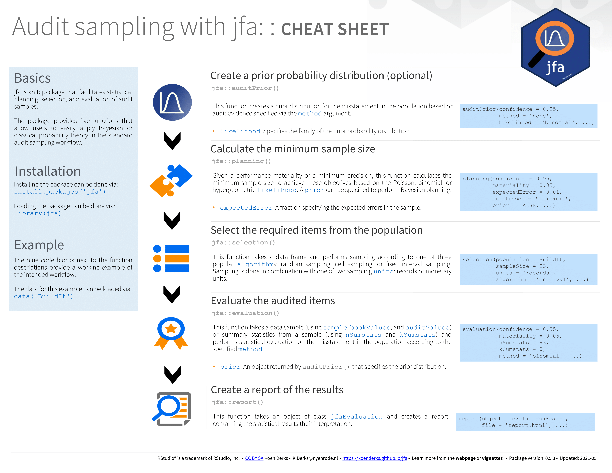
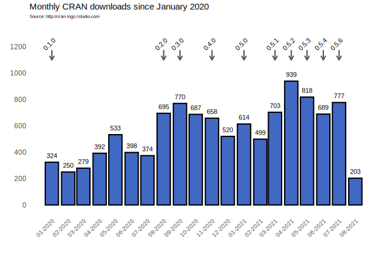
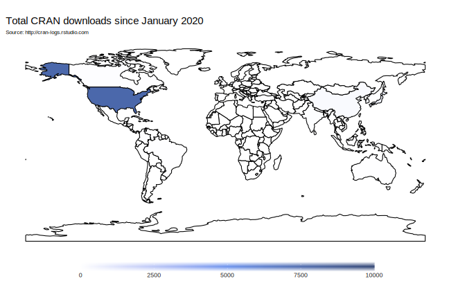

<!-- badges: start -->

 <!-- badges: end -->

# jfa: Bayesian and Classical Audit Sampling

`jfa` is an R package for statistical audit sampling. The package
provides the user with five functions for planning, performing,
evaluating, and reporting an audit sample. Specifically, it contains
functions for calculating sample sizes, selecting the transactions
according to standard audit sampling techniques, and calculating various
upper limits for the misstatement from the sample or from summary
statistics. The `jfa` package also allows the user to create a prior
probability distribution to perform Bayesian audit sampling using these
functions.

For complete documentation of the package, see the [package
manual](https://cran.r-project.org/package=jfa/jfa.pdf) or visit the
[website](https://koenderks.github.io/jfa/).

## Overview

  - [Getting started](#getting-started)
  - [Benchmarks](#benchmarks)
  - [Contributing](#contributing)
  - [Cheatsheet](#cheatsheet)
  - [Functions](#functions)
  - [References](#references)
  - [Package statistics](#package-statistics)

### Authors

  - **Koen Derks** - *Initial work* - [Website](https://koenderks.com)

See also the list of
[contributors](https://github.com/koenderks/jfa/graphs/contributors) who
participated in this project.

### License

This project is licensed under the open-source
[GPL-3](https://www.r-project.org/Licenses/GPL-3) License.

## Getting started

The following instructions will get the `jfa` package up and running on
your local machine for use in R and RStudio.

### Prerequisites

  - [R](https://cran.r-project.org) - The programming language used for
    deploying the package.

### Installing

The `jfa` package is simple to download and set-up. The most recent
version from [CRAN](https://cran.r-project.org/package=jfa) (0.5.1) can
be downloaded by running the following command in R or RStudio:

    install.packages("jfa")

Alternatively, you can download the most recent (development) version
from GitHub using:

    devtools::install.github("koenderks/jfa")

The `jfa` package can then be loaded in R or RStudio by typing:

    library(jfa)

### Vignettes

The package vignettes show how to use the `jfa` package using simple
examples.

  - [Get started](https://koenderks.github.io/jfa/articles/jfa.html)
  - [The audit sampling
    workflow](https://koenderks.github.io/jfa/articles/v1auditWorkflow.html)
  - [Constructing a prior
    distribution](https://koenderks.github.io/jfa/articles/v2priorDistributions.html)
  - [Estimating the
    misstatement](https://koenderks.github.io/jfa/articles/v3estimation.html)
  - [Testing the
    misstatement](https://koenderks.github.io/jfa/articles/v4testing.html)

## Benchmarks

To validate the output, `jfa`’s results are currently being verified
against the following benchmark(s):

  - [Audit Sampling: Audit
    Guide](https://future.aicpa.org/cpe-learning/publication/audit-sampling-audit-guide-OPL)
    (Appendix A and Appendix C)

## Contributing

`jfa` is an open-source project that aims to be useful for the audit
community. Your help in benchmarking and extending `jfa` is therefore
greatly appreciated. Contributing to `jfa` does not have to take much
time or knowledge, and there is extensive information available about it
on the [Wiki](https://github.com/koenderks/jfa/wiki) of this repository.

If you are willing to contribute to the improvement of the package by
adding a benchmark, please check out the Wiki page on [how to contribute
a benchmark to jfa](https://github.com/koenderks/jfa/wiki/Benchmarks).
If you are willing to contribute to the improvement of the package by
adding a new statistical method, please check the Wiki page on [how to
contribute a new method to
jfa](https://github.com/koenderks/jfa/wiki/Methods).

## Cheatsheet

The cheatsheet can help you get started with the `jfa` package and its
workflow. You can download a pdf version
[here](https://github.com/koenderks/jfa/raw/master/man/figures/cheatsheet/cheatsheet.pdf).

## Functions

Below you can find a list of the functions in the current version of
`jfa` sorted by their occurrence in the standard audit sampling
workflow.

  - [`auditPrior()`](#create-a-prior-distribution-with-the-auditprior-function)
  - [`planning()`](#plan-a-sample-with-the-planning-function)
  - [`selection()`](#select-transactions-with-the-selection-function)
  - [`evaluation()`](#evaluate-a-sample-with-the-evaluation-function)
  - [`report()`](#generate-a-report-with-the-report-function)

### Create a prior distribution with the `auditPrior()` function:

The `auditPrior()` function creates a prior distribution according to
one of several methods, including the audit risk model and assessments
of the inherent and control risk. The returned object is of class
`jfaPrior` and can be used with associated `print()` and `plot()`
methods. `jfaPrior` results can also be used as input argument for the
`prior` argument in other functions.

*Full function with default arguments:*

`auditPrior(confidence = 0.95, likelihood = "binomial", method = "none",
expectedError = 0, N = NULL, materiality = NULL, ir = 1, cr = 1, pHmin =
NULL, pHplus = NULL, factor = 1, sampleN = 0, sampleK = 0)`

*Supported options for the `likelihood` argument:*

| `likelihood`     | Reference              | Description                                                    |
| ---------------- | ---------------------- | -------------------------------------------------------------- |
| `binomial`       | Steele (1992)          | Beta prior distribution (+ binomial likelihood)                |
| `poisson`        | Stewart (2013)         | Gamma prior distribution (+ Poisson likelihood)                |
| `hypergeometric` | Dyer and Pierce (1991) | Beta-binomial prior distribution (+ hypergeometric likelihood) |

*Supported options for the `method` argument:*

| `method`     | Reference           | Description                                   | Additional arguments              |
| ------------ | ------------------- | --------------------------------------------- | --------------------------------- |
| `none`       | Derks et al. (2020) | No prior information                          |                                   |
| `arm`        | Derks et al. (2020) | Inherent risk and internal control risk (ARM) | `ir` and `cr`                     |
| `median`     | Derks et al. (2020) | Equal prior probabilities for hypotheses      |                                   |
| `hypotheses` | Derks et al. (2020) | Custom prior probabilities for hypotheses     | `pHmin` or `pHplus`               |
| `sample`     | Derks et al. (2020) | Earlier sample                                | `sampleN` and `sampleK`           |
| `factor`     | Derks et al. (2020) | Weighted earlier sample                       | `factor`, `sampleN` and `sampleK` |

### Plan a sample with the `planning()` function:

The `planning()` function calculates the required sample size for a
statistical audit sample, based on the Poisson, binomial, or
hypergeometric likelihood. A prior can be specified to combine with the
specified likelihood in order to perform Bayesian planning. The returned
`jfaPlanning` object has a `print()` and a `plot()` method. In the
`planning()` function, the `prior` argument can be an object of class
`jfaPrior` as returned by the `auditPrior()` function.

*Full function with default arguments:*

`planning(confidence = 0.95, expectedError = 0, likelihood = "poisson",
N = NULL, materiality = NULL, minPrecision = NULL, prior = FALSE, kPrior
= 0, nPrior = 0, increase = 1, maxSize = 5000)`

*Supported options for the `likelihood` argument:*

| `likelihood`     | Reference      | Description               |
| ---------------- | -------------- | ------------------------- |
| `binomial`       | Stewart (2012) | Binomial likelihood       |
| `poisson`        | Stewart (2012) | Poisson likelihood        |
| `hypergeometric` | Stewart (2012) | Hypergeometric likelihood |

### Select transactions with the `selection()` function:

The `selection()` function takes a data frame and performs sampling
according to one of three algorithms: random sampling, cell sampling, or
fixed interval sampling in combination with either record sampling or
monetary unit sampling. The returned `jfaSelection` object has a
`print()` and a `plot()` method. In the `selection()` function, the
`sampleSize` argument can be an object of class `jfaPlanning` as
returned by the `planning()` function.

*Full function with default arguments:*

`selection(population, sampleSize, units = "records", algorithm =
"random", bookValues = NULL, intervalStartingPoint = 1, ordered = TRUE,
ascending = TRUE, withReplacement = FALSE, seed = 1)`

*Supported options for the `units` argument:*

| `units`   | Reference                               | Description                       | Additional arguments |
| --------- | --------------------------------------- | --------------------------------- | -------------------- |
| `records` | Leslie, Teitlebaum, and Anderson (1979) | Sampling units are transactions   |                      |
| `mus`     | Leslie, Teitlebaum, and Anderson (1979) | Sampling units are monetary units | `bookValues`         |

*Supported options for the `algorithm` argument:*

| `algorithm` | Reference | Description                                   | Additional arguments    |
| ----------- | --------- | --------------------------------------------- | ----------------------- |
| `random`    |           | Random sampling                               |                         |
| `cell`      |           | Cell sampling                                 |                         |
| `interval`  |           | Systematic sampling / Fixed interval sampling | `intervalStartingPoint` |

### Evaluate a sample with the `evaluation()` function:

The `evaluation()` function takes a sample data frame or summary
statistics about an evaluated audit sample and calculates a confidence
bound according to a specified method. The returned `jfaEvalution`
object has a `print()` and `plot()` method. In the `evaluation()`
function, the `prior` argument can be an object of class `jfaPrior` as
returned by the `auditPrior()` function.

*Full function with default arguments:*

`evaluation(confidence = 0.95, method = "binomial", N = NULL, sample =
NULL, bookValues = NULL, auditValues = NULL, counts = NULL, nSumstats =
NULL, kSumstats = NULL, materiality = NULL, minPrecision = NULL, prior =
FALSE, nPrior = 0, kPrior = 0, rohrbachDelta = 2.7, momentPoptype =
"accounts", populationBookValue = NULL, csA = 1, csB = 3, csMu = 0.5)`

*Supported options for the `method` argument:*

| `method`          | Reference                             | Description                             | Additional arguments     |
| ----------------- | ------------------------------------- | --------------------------------------- | ------------------------ |
| `binomial`        | Stewart (2012)                        | Binomial likelihood                     |                          |
| `poisson`         | Stewart (2012)                        | Poisson likelihood                      |                          |
| `hypergeometric`  | Stewart (2012)                        | Hypergeometric likelihood               |                          |
| `stringer`        | Bickel (1992)                         | Classical Stringer bound                |                          |
| `stringer-meikle` | Meikle (1972)                         | Stringer bound with Meikle’s correction |                          |
| `stringer-lta`    | Leslie, Teitlebaum, & Anderson (1979) | Stringer bound with LTA correction      |                          |
| `stringer-pvz`    | Pap and van Zuijlen (1996)            | Modified Stringer bound                 |                          |
| `rohrbach`        | Rohrbach (1993)                       | Rohrbach’s augmented variance estimator | `rohrbachDelta`          |
| `moment`          | Dworin and Grimlund (1984)            | Modified moment bound                   | `momentPoptype`          |
| `coxsnell`        | Cox and Snell (1979)                  | Cox and Snell bound                     | `csA`, `csB`, and `csMu` |
| `direct`          | Touw and Hoogduin (2011)              | Direct estimator                        | `populationBookValue`    |
| `difference`      | Touw and Hoogduin (2011)              | Difference estimator                    | `populationBookValue`    |
| `quotient`        | Touw and Hoogduin (2011)              | Quotient estimator                      | `populationBookValue`    |
| `regression`      | Touw and Hoogduin (2011)              | Regression estimator                    | `populationBookValue`    |

### Generate a report with the `report()` function:

The `report()` function takes an object of class `jfaEvaluation` as
returned by the `evaluation()` function, automatically generates a
`html` or `pdf` report containing the analysis results and their
interpretation, and saves the report to your local computer.

*Full function with default arguments:*

`report(object = NULL, file = NULL, format = "html_document")`

For an example report, see the following
[link](https://github.com/koenderks/jfa/raw/master/man/figures/readme/report/report.pdf).

## References

  - Bickel, P. J. (1992). Inference and auditing: The Stringer bound.
    *International Statistical Review*, 60(2), 197–209. - [View
    online](https://www.jstor.org/stable/1403650)
  - Cox, D. R., & Snell, E. J. (1979). On sampling and the estimation of
    rare errors. *Biometrika*, 66(1), 125-132. - [View
    online](https://doi.org/10.1093/biomet/66.1.125)
  - Derks, K. (2021). jfa: Bayesian and classical audit sampling. R
    package version 0.5.1. - [View
    online](https://cran.r-project.org/package=jfa)
  - Derks, K., de Swart, J., van Batenburg, P., Wagenmakers, E.-J., &
    Wetzels, R. (2020). Priors in a Bayesian audit: How integration of
    existing information into the prior distribution can improve audit
    transparency and efficiency. *Under review*. - [View
    online](https://psyarxiv.com/8fhkp/)
  - Dworin, L. D. and Grimlund, R. A. (1984). Dollar-unit sampling for
    accounts receivable and inventory. *The Accounting Review*, 59(2),
    218–241. - [View online](https://www.jstor.org/stable/247296)
  - Dyer, D., & Pierce, R. L. (1993). On the choice of the prior
    distribution in hypergeometric sampling. *Communications in
    Statistics - Theory and Methods*, 22(8), 2125-2146. - [View
    online](https://www.tandfonline.com/doi/abs/10.1080/03610929308831139)
  - Meikle, G. R. (1972). *Statistical Sampling in an Audit Context*.
    Canadian Institute of Chartered Accountants.
  - Leslie, D. A., Teitlebaum, A. D., & Anderson, R. J. (1979).
    *Dollar-unit sampling: A practical guide for auditors*. London:
    Pitman.
  - Pap, G., & van Zuijlen, M. C. (1996). On the asymptotic behaviour of
    the Stringer bound. *Statistica Neerlandica*, 50(3), 367-389. -
    [View online](https://doi.org/10.1111/j.1467-9574.1996.tb01503.x)
  - Rohrbach, K. J. (1993). Variance augmentation to achieve nominal
    coverage probability in sampling from audit populations. *Auditing:
    A Journal of Practice & Theory*, 12(2), 79-97.
  - Steele, A. (1992). *Audit risk and audit evidence: The Bayesian
    approach to statistical auditing*. San Diego: Academic Press.
  - Stewart, T. R. (2012). *Technical notes on the AICPA audit guide
    audit sampling*. American Institute of Certified Public Accountants,
    New York. - [View
    online](https://www.aicpa.org/content/dam/aicpa/publications/accountingauditing/keytopics/downloadabledocuments/sampling-guide-technical-notes.pdf)
  - Stewart, T. R. (2013). *A Bayesian audit assurance model with
    application to the component materiality problem in group audits.*
    VU University, Amsterdam. - [View
    online](https://research.vu.nl/en/publications/a-bayesian-audit-assurance-model-with-application-to-the-componen)
  - Touw, P., and Hoogduin, L. (2011). *Statistiek voor audit en
    controlling*. Boom uitgevers, Amsterdam.

## Package statistics

