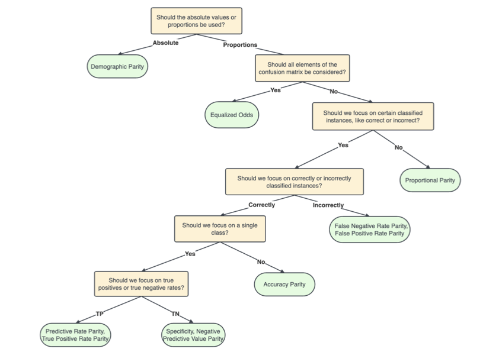

```{r, include = FALSE}
library(jfa)
```

## Introduction

Welcome to the 'Algorithmic fairness' vignette of the **jfa** package. In this
vignette you can find a detailed example of how you can use the
`model_fairness()` function provided by the package.

## Function: `model_fairness()`

The `model_fairness()` function provides a method to assess fairness in
algorithmic decision-making systems by computing various model-agnostic metrics
based on the observed and predicted labels in a data set. Calculated metrics
include demographic parity, proportional parity, predictive rate parity,
accuracy parity, false negative rate parity, false positive rate parity, true
positive rate parity, negative predicted value parity, and specificity parity.

Note that, in an audit context, not all fairness measures are equally
appropriate in all situations. The decision tree below aids with choosing which
measure is best for the situation at hand (Büyük, 2023).

<p align='center'></p>

*Example:*

To illustrate how to use the `model_fairness()` function, we will use a
well-known data set called COMPAS. The COMPAS (Correctional Offender Management
Profiling for Alternative Sanctions) software is is a case management and
decision support tool used by some U.S. courts to assess the likelihood of a
defendant becoming a recidivist (repeated offender). 

The `compas` data is included in the package and contains predictions of the
COMPAS software for several cases. The data can be loaded with `data("compas")`
and contains for each defendant, whether the defendant did commit a crime within
two years after the court case (`TwoYrRecidivism`), some personal
characteristics like gender and ethnicity, and whether the software predicted
the defendant to be a recidivist (`Predicted`). 

```{r}
data("compas")
head(compas)
```

We will investigate whether the algorithm is fair with respect to the sensitive
attribute `Ethnicity`. Considering the context, a positive prediction means that
a defendant is classified as a reoffender, and a negative prediction means that
a defendant is classified as a non-reoffender. The fairness metrics offer
information on whether there are any disparities in the algorithm's predictions
across different ethnic groups. By calculating and reviewing these metrics, we
can get an indication of whether the algorithm exhibits any discriminatory
behavior towards specific ethnic groups. If substantial disparities exist, we 
may need to investigate further and potentially modify the algorithm to ensure
fairness in its predictions.

Before starting, let's briefly explain the foundation of all fairness metrics:
the confusion matrix. This matrix presents observed versus predicted labels,
shedding light on the algorithm's prediction mistakes. Comprising the confusion
matrix are the true positives (TP), false positives (FP), true negatives (TN),
and false negatives (FN). To illustrate, the confusion matrix pertaining to the
`African American` group is displayed below. For example, there are 629 people
in this group that are incorrectly predicted to be a reoffender, which
represents a false positive in the confusion matrix.

|                | Predicted = `No` | Predicted = `Yes`   |
| :----------- : | :--------------: | :-----------------: |
| Actual = `No`  | 885 (`TN`)       | 629 (`FP`)          |
| Actual = `Yes` | 411 (`FN`)       | 1250 (`TP`)         |

Let's interpret the fairness metrics for the African American, Asian, and
Hispanic groups in comparison to the reference group (Caucasian) one by one.

1. **Demographic parity (Statistical parity)**: Compares the number of positive
predictions (e.g., reoffenders) between each ethnic group and the reference
group. Note that, since demographic parity is not a proportion, statistical
inference about its equality to the reference group is not supported for this
metric.

$$DP = TP + FP$$

```{r}
model_fairness(compas, "Ethnicity", "TwoYrRecidivism", "Predicted",
  reference = "Caucasian", positive = "yes", metric = "dp"
)
```

- *African American*: The parity ratio for African Americans compared to
  Caucasians is 2.7961, indicating that there are nearly three times more
  African Americans predicted as reoffenders in these data by the algorithm than
  Caucasians.
- *Asian*: The ratio for Asians is very close to zero (0.0059524), indicating
  that there are many less Asians (4) that are predicted as reoffenders in
  these data than there are Caucasians (672).
- *Hispanic*: The ratio for Hispanics is 0.22173, meaning that there are about
  five times less Hispanics predicted as reoffenders in these data than that
  there are Caucasians.

2. **Proportional parity (Disparate impact)**: Compares the positive prediction
rates (e.g., true positive rate) of each ethnic group with the reference group.

$$PP = (TP + FP) / (TP + FP + TN + FN)$$

```{r}
model_fairness(compas, "Ethnicity", "TwoYrRecidivism", "Predicted",
  reference = "Caucasian", positive = "yes", metric = "pp"
)
```

- *African American*: The ratio of true positive rates (TPRs) for African
  Americans compared to Caucasians is 1.8521. This indicates that the TPR for
  African Americans is approximately 1.85 times higher than for Caucasians.
  Again, this suggests potential bias in the algorithm's predictions against
  African Americans. The p-value is smaller than .05, indicating that the null
  hypothesis of equal proportional parity should be rejected.
- *Asian*: The proportional parity ratio for Asians is 0.4038, indicating that
  their TPR is lower than for Caucasians. This suggests potential
  underestimation of reoffenders among Asians.
- *Hispanic*: The ratio for Hispanics is 0.91609, suggesting that their TPR is
  close to the reference group (Caucasians). This indicates relatively fair
  treatment of Hispanics in the algorithm's predictions.

For this (and all of the following) metrics, Bayesian inference is supported and
provides credible intervals and Bayes factors. Like in the other functions in
`jfa`, performing a Bayesian analysis using a default prior can be achieved by
setting `prior = TRUE`. The resulting Bayes factors in favor of rejection of the
null hypothesis ($BF_{10}$) are shown in the output below.

```{r}
model_fairness(compas, "Ethnicity", "TwoYrRecidivism", "Predicted",
  reference = "Caucasian", positive = "yes", metric = "pp", prior = TRUE
)
```

3. **Predictive rate parity (Equalized odds)**: Compares the overall positive
prediction rates (e.g., reoffender prediction) of different ethnic groups with
the reference group.

$$PRP = TP / (TP + FP)$$

```{r}
model_fairness(compas, "Ethnicity", "TwoYrRecidivism", "Predicted",
  reference = "Caucasian", positive = "yes", metric = "prp"
)
```

- *African American*: The predictive rate parity ratio for African Americans
  is 1.1522. This suggests that the overall positive prediction rate for
  African Americans is approximately 1.15 times higher than for Caucasians.
  This indicates potential favoritism towards African Americans in the overall
  positive predictions made by the algorithm.
- *Asian*: The ratio for Asians is 0.86598, indicating that their overall
  positive prediction rate is lower than for Caucasians. This suggests
  potential underestimation of reoffenders among Asians by the algorithm.
- *Hispanic*: The predictive rate parity ratio for Hispanics is 1.0229,
  suggesting their overall positive prediction rate is very close to that of
  the reference group (Caucasians). This indicates relatively fair treatment
  in the algorithm's overall positive predictions.

4. **Accuracy parity**: Compares the accuracy of each ethnic group's predictions
with the reference group.

$$AP = (TP + TN) / (TP + FP + TN + FN)$$

```{r}
model_fairness(compas, "Ethnicity", "TwoYrRecidivism", "Predicted",
  reference = "Caucasian", positive = "yes", metric = "ap"
)
```

- African American: The accuracy parity ratio for African Americans is 1.021,
  suggesting their accuracy is very similar to the reference group
  (Caucasians). This indicates fair treatment concerning overall accuracy.
- *Asian*: The accuracy parity ratio for Asians is 1.1266, suggesting their
  accuracy is slightly higher than for Caucasians, indicating potential
  favoritism in overall accuracy.
- *Hispanic*: The ratio for Hispanics is 1.0351, suggesting their accuracy
  is slightly higher than for Caucasians, indicating potential favoritism in
  overall accuracy.

5. **False negative rate parity (Treatment equality)**: Compares the false
negative rates (e.g., for reoffenders) of each ethnic group with the reference
group.

$$FNRP = FN / (TP + FN)$$

```{r}
model_fairness(compas, "Ethnicity", "TwoYrRecidivism", "Predicted",
  reference = "Caucasian", positive = "yes", metric = "fnrp"
)
```

- *African American*: The ratio of false negative rates (FNRs) for African
  Americans compared to Caucasians is 0.46866. A value lower than 1 suggests
  that African Americans are less likely to be falsely classified as
  non-reoffenders, indicating potential bias against this group in this
  aspect.
- *Asian*: The ratio for Asians is 1.4205, indicating that they are more
  likely to be falsely classified as non-reoffenders compared to Caucasians,
  suggesting potential underestimation of reoffenders among Asians.
- *Hispanic*: The FNR parity ratio for Hispanics is 1.0121, indicating
  relatively similar rates as the reference group (Caucasians), suggesting
  fair treatment in this aspect.

6. **False positive rate parity**: Compares the false positive rates (e.g., for
non-reoffenders) of each ethnic group with the reference group.

$$FPRP = FP / (TN + FP)$$

```{r}
model_fairness(compas, "Ethnicity", "TwoYrRecidivism", "Predicted",
  reference = "Caucasian", positive = "yes", metric = "fprp"
)
```

- *African American*: The false positive rate parity ratio for African
  Americans is 1.8739. This indicates that African Americans are approximately
  1.87 times more likely to be falsely predicted as reoffenders than
  Caucasians. This suggests potential bias in the algorithm's false positive
  predictions in favor of African Americans.
- *Asian*: The ratio for Asians is 0.39222, indicating that they are less
  likely to be falsely predicted as reoffenders compared to Caucasians. This
  suggests potential fair treatment of Asians in false positive predictions.
- *Hispanic*: The false positive rate parity ratio for Hispanics is 0.85983,
  suggesting they are less likely to be falsely predicted as reoffenders
  compared to Caucasians. This indicates potential fair treatment of Hispanics
  in false positive predictions.

7. **True positive rate parity (Equal opportunity)**: Compares the true positive
rates (e.g., for reoffenders) of each ethnic group with the reference group.

$$TPRP = TP / (TP + FN)$$

```{r}
model_fairness(compas, "Ethnicity", "TwoYrRecidivism", "Predicted",
  reference = "Caucasian", positive = "yes", metric = "tprp"
)
```

- *African American*: The true positive rate parity ratio for African
  Americans is 1.5943. This indicates that African Americans are approximately
  1.59 times more likely to be correctly predicted as reoffenders than
  Caucasians. This suggests potential favoritism towards African Americans in
  true positive predictions made by the algorithm.
- *Asian*: The ratio for Asians is 0.52964, indicating that they are less
  likely to be correctly predicted as reoffenders compared to Caucasians. This
  suggests potential underestimation of reoffenders among Asians by the
  algorithm.
- *Hispanic:* The true positive rate parity ratio for Hispanics is 0.98642,
  suggesting their true positive rate is very close to that of the reference
  group (Caucasians). This indicates relatively fair treatment in the
  algorithm's true positive predictions.

8. **Negative predicted value parity**: Compares the negative predicted values
(e.g., for non-reoffenders) of each ethnic group with the reference group.

$$NPVP = TN / (TN + FN)$$

```{r}
model_fairness(compas, "Ethnicity", "TwoYrRecidivism", "Predicted",
  reference = "Caucasian", positive = "yes", metric = "npvp"
)
```

- *African American*: The Negative predicted value (NPV) parity ratio for
  African Americans is 0.98013. A value close to 1 indicates that the NPV for
  African Americans is very similar to the reference group (Caucasians). This
  suggests fair treatment in predicting non-reoffenders among African
  Americans.
- *Asian*: The NPV parity ratio for Asians is 1.1163, indicating that their
  NPV is slightly higher than for Caucasians. This could suggest potential
  favoritism towards Asians in predicting non-reoffenders.
- *Hispanic*: The NPV parity ratio for Hispanics is 1.0326, suggesting that
  their NPV is slightly higher than for Caucasians. This indicates potential
  favoritism towards Hispanics in predicting non-reoffenders.

9. **Specificity parity (True negative rate parity)**: Compares the specificity
(true negative rate) of each ethnic group with the reference group.

$$SP = TN / (TN + FP)$$

```{r}
model_fairness(compas, "Ethnicity", "TwoYrRecidivism", "Predicted",
  reference = "Caucasian", positive = "yes", metric = "sp"
)
```

- *African American*: The specificity parity ratio for African Americans is
  0.75105. A value lower than 1 indicates that the specificity for African
  Americans is lower than for Caucasians. This suggests potential bias in
  correctly identifying non-reoffenders among African Americans.
- *Asian*: The specificity parity ratio for Asians is 1.1731, indicating their
  specificity is slightly higher than for Caucasians. This could suggest
  potential favoritism in correctly identifying non-reoffenders among Asians.
- *Hispanic*: The specificity parity ratio for Hispanics is 1.0399, suggesting
  that their specificity is very close to the reference group (Caucasians).
  This indicates relatively fair treatment in correctly identifying
  non-reoffenders among Hispanics.

## References

- Büyük, S. (2023). *Automatic Fairness Criteria and Fair Model Selection for Critical ML Tasks*, Master Thesis, Utrecht University. - [View Online](https://studenttheses.uu.nl/handle/20.500.12932/44225)
- Calders, T., & Verwer, S. (2010). Three naive Bayes approaches for discrimination-free classification. In *Data Mining and Knowledge Discovery*. Springer Science and Business Media LLC. - [View Online](https://doi.org/10.1007/s10618-010-0190-x)
- Chouldechova, A. (2017). Fair Prediction with Disparate Impact: A Study of Bias in Recidivism Prediction Instruments. In *Big Data*. Mary Ann Liebert Inc.  - [View Online](https://doi.org/10.1089/big.2016.0047)
- Feldman, M., Friedler, S. A., Moeller, J., Scheidegger, C., & Venkatasubramanian, S. (2015). Certifying and Removing Disparate Impact. In *Proceedings of the 21th ACM SIGKDD International Conference on Knowledge Discovery and Data Mining. ACM. - [View Online](https://doi.org/10.1145/2783258.2783311)
- Fisher, R. A. (1970). *Statistical Methods for Research Workers*. Oliver & Boyd.
- Friedler, S. A., Scheidegger, C., Venkatasubramanian, S., Choudhary, S., Hamilton, E. P., & Roth, D. (2019). A comparative study of fairness-enhancing interventions in machine learning. In *Proceedings of the Conference on Fairness, Accountability, and Transparency*. ACM. - [View Online](https://doi.org/10.1145/3287560.3287589)
- Jamil, T., Ly, A., Morey, R. D., Love, J., Marsman, M., & Wagenmakers, E. J. (2017). Default "Gunel and Dickey" Bayes factors for contingency tables. \emph{Behavior Research Methods}, 49, 638-652. - [View Online](https://doi.org/10.3758/s13428-016-0739-8)
- Pessach, D. & Shmueli, E. (2022). A review on fairness in machine learning. *ACM Computing Surveys*, 55(3), 1-44. - [View Online](https://doi.org/10.1145/3494672)
- Zafar, M. B., Valera, I., Gomez Rodriguez, M., & Gummadi, K. P. (2017). Fairness Beyond Disparate Treatment & Disparate Impact. In *Proceedings of the 26th International Conference on World Wide Web*. - [View Online](https://doi.org/10.1145/3038912.3052660)
